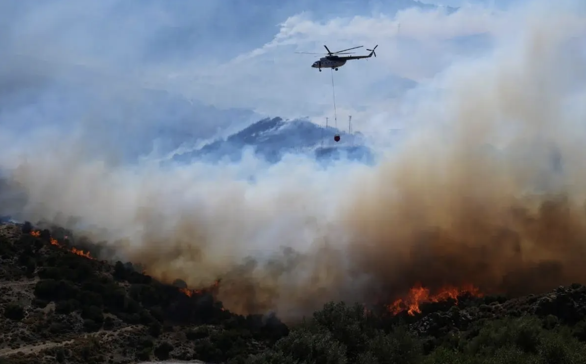
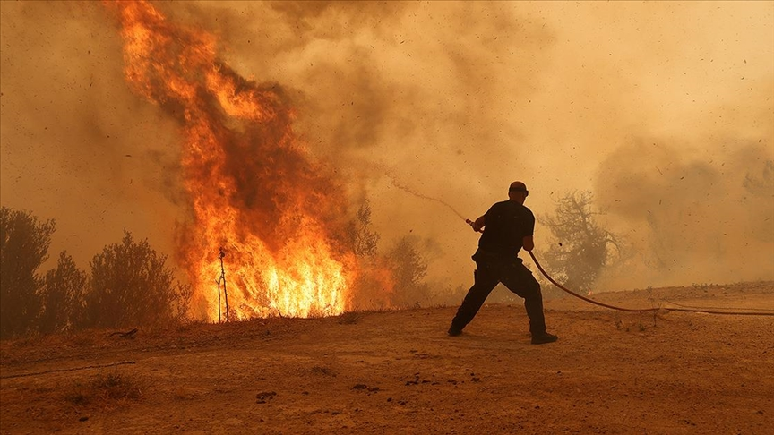
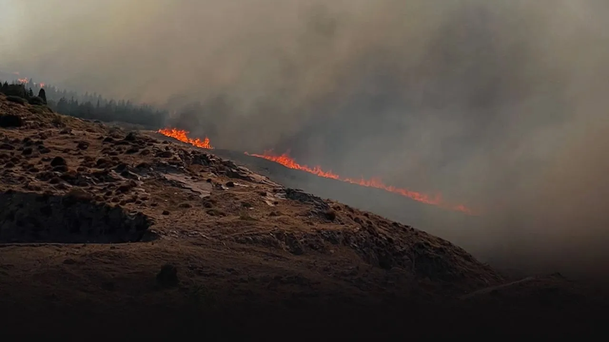
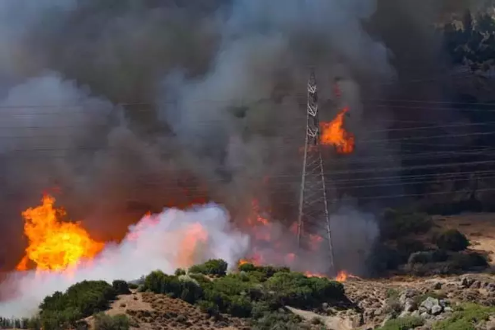
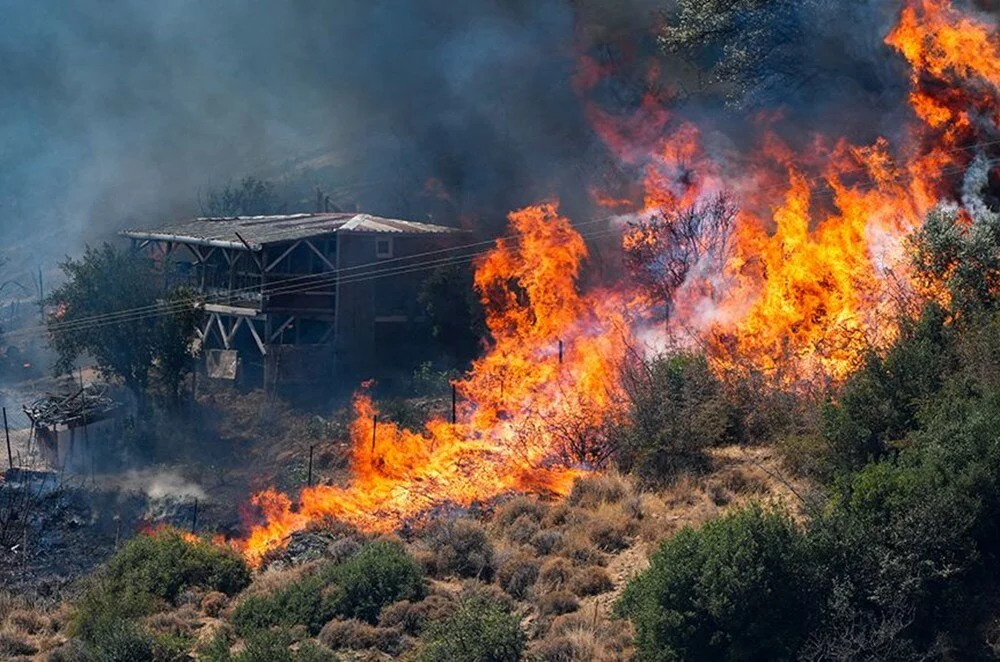
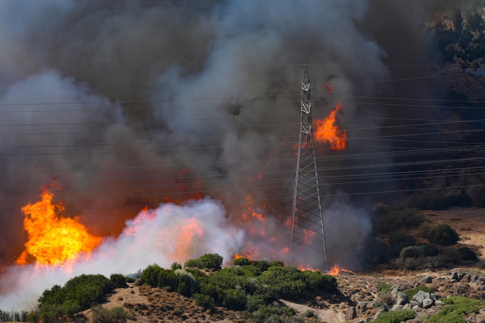

# YOLOv8 Fire Detection System

This project implements a real-time fire detection system using YOLOv8 model. The system is capable of detecting fires in real-time through webcam feed.

## Demo Results

Here are some example detections from our model:






## Project Overview

- **Model**: YOLOv8m trained on fire detection
- **Dataset**: 
  - ~9000 fire images from various environments
  - Dataset prepared and annotated using Roboflow
  - Includes diverse fire scenarios and environmental conditions
- **Training Details**:
  - Transfer Learning from pre-trained YOLOv8 model
  - 50 epochs of training
  - Multiple YOLO versions were tested for optimal performance

## Features

- Real-time fire detection through webcam
- Pre-trained model optimized for fire detection
- Easy-to-use Python implementation

## Requirements

```bash
ultralytics
opencv-python
numpy
```

## Usage

1. Make sure you have the required dependencies installed
2. Place the trained model file (`best.pt`) in the project directory
3. Run the detection script .py

## Model Training Details

The model was trained using transfer learning on YOLOv8 with approximately 9000 fire images. The dataset was prepared and annotated using Roboflow's comprehensive computer vision platform, ensuring high-quality annotations and proper data preprocessing. The training process involved:

- Data preparation and augmentation through Roboflow
- 50 epochs of training
- Multiple YOLO versions testing for optimal performance
- Various environmental conditions for robust detection

## Additional Test Results

More detection examples from different scenarios:





## References

1. **YOLOv8**
   - [Ultralytics YOLOv8 Documentation](https://docs.ultralytics.com/)
   - [YOLOv8 GitHub Repository](https://github.com/ultralytics/ultralytics)

2. **Dataset Platform**
   - [Roboflow Universe](https://universe.roboflow.com/)
   - [Roboflow Documentation](https://docs.roboflow.com/)

3. **Computer Vision**
   - [OpenCV Documentation](https://docs.opencv.org/)
   - [Real-time Object Detection Overview](https://opencv.org/object-detection/)

4. **Transfer Learning**
   - [Transfer Learning in Deep Learning](https://www.tensorflow.org/tutorials/images/transfer_learning)
   - [Deep Learning for Computer Vision](https://www.deeplearning.ai/)

5. **Fire Detection Research**
   - Jadon, A., et al. (2019). "Fire detection using image processing techniques with machine learning"
   - Muhammad, K., et al. (2018). "Convolutional Neural Networks Based Fire Detection in Surveillance Videos"

## License

This project is licensed under the MIT License - see the LICENSE file for details.

## Note

This system is designed for real-time fire detection through webcam feed. The model has been trained on a diverse dataset to ensure reliable detection across different environments and conditions. 